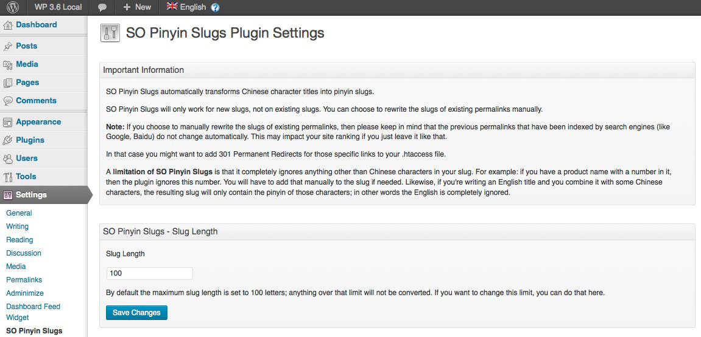
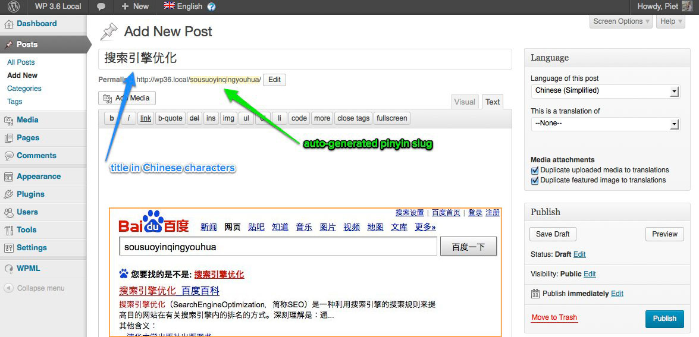

# Pinyin Slugs

  

###### Last updated on April 27, 2025
###### tested up to WP 6.8
###### Authors: [Pieter Bos](https://github.com/senlin)
###### [Stable Version](https://wordpress.org/plugins/so-pinyin-slugs) (via WordPress Plugins Repository)
###### [Plugin homepage](https://so-wp.com/plugin/pinyin-slugs)

WordPress plugin that transforms both Simplified and Traditional Chinese character titles into a permalink friendly slug, showing pinyin that can be read by humans and (Chinese) search engines alike.

## Description

Chinese characters don't come out good in permalinks. Without the Pinyin Slugs plugin activated, the example post I made for the screenshot will get a slug like this: *%e6%90%9c%e7%b4%a2%e5%bc%95%e6%93%8e%e4%bc%98%e5%8c%96*. With the plugin the slug automatically becomes *sousuoyinqingyouhua*.

Search engines such as [Baidu](https://www.baidu.com) cannot make much of the first slug, but they can handle pinyin perfectly, especially when it is written as one long string without hyphens or underscores.

It is possible to limit the amount of characters in the slug. The default is 100, which should be plenty for most.

The Pinyin Slugs plugin was forked from the [Pinyin Permalinks](https://wordpress.org/plugins/pinyin-permalink/) plugin by user [xiaole_tao](https://profiles.wordpress.org/xiaole_tao/) as that project seemed abandoned. There have been many improvements since; read the changelog for details.

### WPML Compatible

The Pinyin Slugs plugin has received the [WPML Certification of Compatibility](https://wpml.org/plugin/so-pinyin-slugs/).

## Frequently Asked Questions

### Does Pinyin Slugs work with Simplified Chinese characters?

Yes, the plugin transforms Simplified Chinese slugs into pinyin.

### Does Pinyin Slugs work with Traditional Chinese characters?

Yes, since September 2020 the plugin also can transform Traditional Chinese slugs into pinyin.

### Does Pinyin Slugs work with the WP block editor?

Yes, it does, although one caveat is that to be able to see the change of slug, the post/page first needs to be saved. The same applies for edits.

### Known Issues

Pinyin Slugs will not transform existing slugs, you will have to change them manually.

### I have an issue with this plugin, where can I get support?

Please open an issue here on [Github](https://github.com/senlin/pinyin-slugs/issues)

## Contributions

This repo is open to _any_ kind of contributions.

## License

* License: GNU Version 2 or Any Later Version
* License URI: http://www.gnu.org/licenses/gpl-2.0.html

## Donations

* Donate link: https://so-wp.com/plugins/donations

## Connect with me through

[BHI Localization for Websites](https://www.bhi-localization.com)

[SO WP](https://so-wp.com)

[Github](https://github.com/senlin)

[LinkedIn](https://www.linkedin.com/in/pieterbos83/)

[WordPress](https://profiles.wordpress.org/senlin/)

## Changelog

### 2.3.5

* date: April 27, 2025
* removed redundant `load_plugin_textdomain()` function and increased min required WP version
* tested up to WP 6.8

### 2.3.4

* date: March 11, 2025
* fix [issue27](https://github.com/senlin/pinyin-slugs/issues/27) thanks for the PR @yabwee
* tested up to WP 6.7

### 2.3.3

* date: July 9, 2024
* add new $autoload parameter (WP 6.6)
* tested up to WP 6.6
* removed logo from Settings page

### 2.3.2

* date: November 27, 2023
* last security fix introduced problem where spaces in Title where no longer replaced by hyphens, this version brings back those hyphens ([issue 23](https://github.com/senlin/pinyin-slugs/issues/23) thanks for pointing it out @nhimthaoan)

### 2.3.1

* date: November 23, 2023
* security fix CVE-2023-47511 Cross Site Scripting (XSS) vulnerability ([issue 22](https://github.com/senlin/pinyin-slugs/issues/22) thanks for pointing it out @ramiror)

### 2.3.0

* date: August 27, 2023
* fix Slug Length function ([issue 19](https://github.com/senlin/pinyin-slugs/issues/19) thanks for reporting @zhouLife)

### 2.2.1

* date: October 25, 2022
* edits in readme files and on Settings page

### 2.2.0

* date: September 16, 2020
* dictionary update: UniHan database using the kMandarin Reading field as pinyin phonetic keys (https://unicode.org/charts/unihan.html); with many thanks to [Yun-yu Shen @ujamer](https://github.com/senlin/pinyin-slugs/pull/16)
* edits in readme files and on Settings page

### 2.1.4

* date: October 29, 2018
* tested up to WP 5.0
* tested up to ClassicPress 1.0.0

### 2.1.3

* date: July 8, 2018
* tested up to WP 4.9.7

### 2.1.2

* date: March 15, 2017
* add sanitize_title filter once the file has been included as per [suggestion](https://github.com/senlin/so-pinyin-slugs/issues/6#issuecomment-284342159) of Polylang author [@Chouby](https://github.com/Chouby)
* tidying up

### 2.1.1

* date: November 29, 2016
* remove version check
* tested up to WP 4.7

### 2.1.0

* date: March 10, 2016
* fix to not ignore alphanumerical characters by [vanabel](https://github.com/vanabel), closes [issue #4](https://github.com/senlin/so-pinyin-slugs/issues/4)

### 2.0.4

* date: August 7, 2015
* TWEAK: header settings page; only showed half logo after 2.0.3 update

### 2.0.3

* date: August 5, 2015
* changed header settings page to h1 (https://make.wordpress.org/plugins/2015/08/03/4-3-change-to-plugin-dashboard-pages/)
* show 4.3 compatibility

### 2.0.2

* date: June 19, 2015
* revert to [semantic versioning](http://semver.org/)

### 2.0.1

* date: April 9, 2015
* changed logos
* new banner image for WP.org Repo by [Joschko Hammermann](https://unsplash.com/hmmrmnn)

### 2.0.0

* date: July 29, 2014
* due to non-compatibility issues with WP 4.0, complete rewrite of the plugin from the ground up
* bump minimum required WP version up to 3.8

### 1.0.1

* date: December 28, 2013
* fix reported [bug](https://github.com/senlin/so-pinyin-slugs/issues/1) that causes entire admin to be a maximum width of 48rem

### 1.0.0

* date: December 26, 2013
* tested up to WP 3.9-alpha
* settings page overhaul to better match WP 3.8 style
* change version number format
* change links

### 0.1.3

* change text domain to prepare for language packs (via Otto - http://otto42.com/el)

### 0.1.2

* redo version check
* change Github link
* add Dutch language files
* add WPML accreditation

### 0.1.1

* separate dictionary.php file
* add Mandarin Chinese language files
* edit readme.txt and readme.md
* fix textdomain issue

### 0.1

* First stable release

## Screenshots

Preview of settings page as well as when adding a new Post

---

